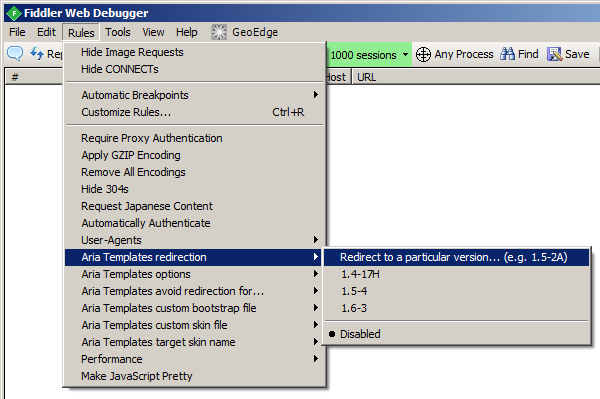
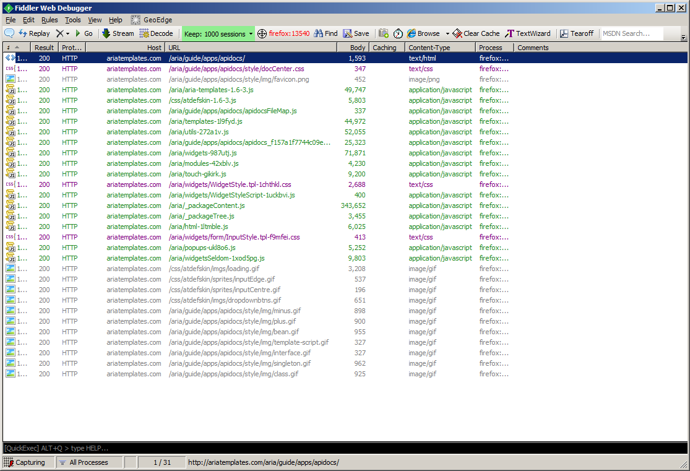
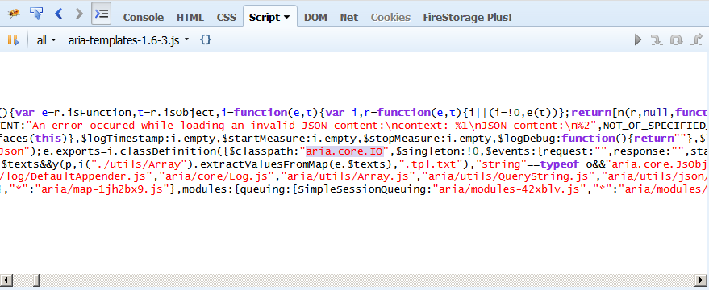
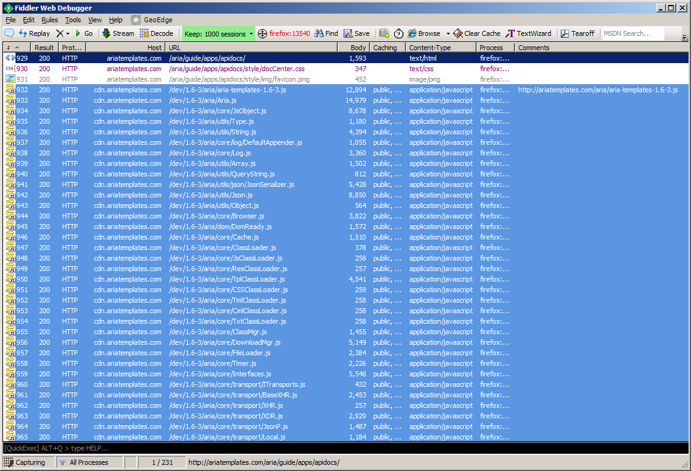
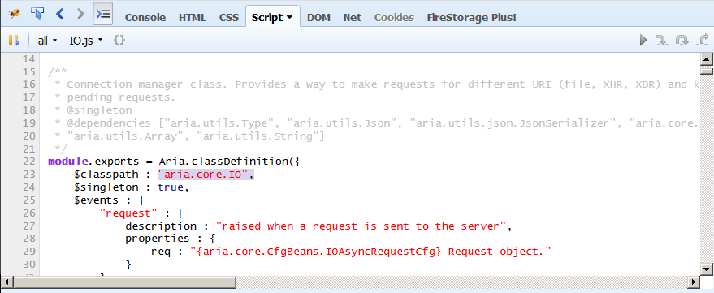

Aria Templates Fiddler rules
============================

This repository contains [Aria Templates](https://github.com/ariatemplates/ariatemplates/)-specific
[CustomRules](http://docs.telerik.com/fiddler/knowledgebase/fiddlerscript/modifyrequestorresponse) file for
[Fiddler](http://www.telerik.com/fiddler).

Fiddler is a **scriptable proxy** for Windows that makes it easy to tamper with HTTP(S) traffic and hence
is a great tool **for web debugging**.

Aria Templates Fiddler rules make use of [AT CDN](http://cdn.ariatemplates.com/) to **extend Fiddler with AT-specific
options** that make it possible to:

- redirect from one version of AT to another
  - redirect to an older version to check for regressions
  - redirect to a newer version to ensure forward-compatibility of your application
  - redirect to a development version without redeploying (e.g. validating a bug fix
    on a production server prior to deployment)
- do a redirection from minified to unminified files of the framework
  - facilitate debugging by having more readable code, with comments
- enable AT debug mode on a remote server without redeploying
  - more informative error messages

Get started in 5 minutes
========================

1. [Download and install Fiddler](http://www.telerik.com/download/fiddler)
1. Run Fiddler and open `http://localhost:8888` in your browser. You should see "Fiddler Echo Service" page.
  - If this port is used by another application on your machine, you have to change the port in Fiddler's settings:
  `Tools` > `Fiddler options...` > `Connections`
1. While Fiddler is active, press `CTRL`+`R` to open its `CustomRules.js` file in the text editor. Copy-paste the contents
   of [`CustomRules.js` file from this repository](https://raw.githubusercontent.com/ariatemplates/fiddler-rules/master/CustomRules.js) and save.
1. In Fiddler's `Rules` menu, you should now see Aria Templates rules.

Note that it's also possible to set up Fiddler as a remote proxy, so that the traffic from an external machine
(e.g. a virtual machine running a particular version of Internet Explorer) can go through the developer's machine.
For more information about that, refer to
[a blog article](http://ariatemplates.com/blog/2013/02/debugging-javascript-css-html-from-a-remote-server-in-remote-browser-with-fiddler/)

Explanation of rules
====================

### Aria Templates redirection

This is the key setting of the rules - if it's disabled, most of the other settings described here will not be applicable.

If enabled, **all files recognized as AT files will be redirected to a specified version of AT**, fetched
from `http://cdn.ariatemplates.com`.

Files are recognized as AT file if their URL contain `/aria/` substring and their file name ends with one of the
following extensions: `js|tpl|tml|cml|css|txt`.

If you have files that match this description and you want to avoid the redirection, there's a separate option for that.

You can either choose one option from a menu, or input a string like `1.5-2A` yourself.

Note that the version you're requesting must be present on AT CDN, otherwise you will get 404 error responses.

### Aria Templates options

#### Target non-minified files

If ticked, the *source files* of the framework will be served (not minified, not packaged). **This affects performance,
but greatly facilitates debugging**.

#### Set Aria.debug = true

*This option may be used separately from the `Aria Templates redirection` option.*

If ticked, AT bootstrap file will be ad-hoc modified, having injected the code to set `Aria.debug = true` to enable
debug mode. Main benefits of the debug mode are:

- JSON validation of configuration objects
- exact line numbers in console messages for errors occurring in templates (`.tpl`)
- setting log level to `debug` instead of `error`

**For development purposes, you should always use `Aria.debug`. Only disable it in the production code
to improve the performance of the application.**

### Aria Templates avoid redirection for... `{RegExp}`

***Useful if***: *you have application files containing `/aria/` in the URLs*

When enabled, a regular expression will be constructed from the input string to prevent redirection for files
matching the provided pattern.

For instance, normally files matching `/aria/**/*.js` are redirected, but you may have a file named
`/aria/myMagicFile.js` and `/aria/myOtherFile.js` (not recommended) which are *application files*, not
*framework files*. Then, you can disable their redirection with the following input:

    (aria/myMagicFile)|(aria/myOtherFile)

**Note:** *the input here will be converted to a `RegExp`, so remember to escape special characters, and avoid
unnecessary whitespace. Make sure your regex applies only to the files you really want to avoid redirecting.*

### Aria Templates custom bootstrap file `{RegExp}`

***Useful if***: *your app uses custom packaging of the framework*

If this is enabled, when the file's URL matches the input, then this file will be recognized as Aria Templates
bootstrap (main) file.

Normally, files with the names like `ariatemplates-1.2.3`, `aria-templates-1.2.3`, `aria-templates-1.1-SNAPSHOT`
are recognized as an AT bootstrap file, but in case your application uses custom packaging of the framework,
you might have to configure this setting so that Fiddler can recognize your bootstrap file and redirect it properly.

**Note:** *the input here will be converted to a `RegExp`, so remember to escape special characters, and avoid
unnecessary whitespace. Make sure your regex applies only to your bootstrap file and NOT other files.*

### Aria Templates custom skin file `{RegExp}`

***Useful if***: *your app uses custom skin, and you want to redirect it to `atskin` or `atflatskin`.*

If this is enabled, it works similarly to custom bootstrap: files matching the pattern will be redirected to
`atskin` or `atflatskin`, depending on the other setting.

**Note:** *the input here will be converted to a `RegExp`, so remember to escape special characters, and avoid
unnecessary whitespace. Make sure your regex applies only to your skin file and NOT other files.*

### Aria Templates target skin name

Whenever a URL is recognized to be a skin file (either default AT skin, or custom skin matching user-provided regex),
it will be redirected accordingly, depending on this setting:

- `atskin` - redirect recognized skin always to `atskin`
- `atflatskin` - redirect recognized skin always to `atflatskin`
- `disabled` - try to infer the skin name from its URL (i.e. redirect `atskin` to `atskin` and `atflatskin`
to `atflatskin`).

Quick start tutorial
====================

Let's have some action and try to use the rules in real life on an Aria Templates application.

1. Run Fiddler and enable capturing (toggle `F12`)
3. Launch Firefox and clear the cache.
2. Open [Aria Templates API doc center](http://ariatemplates.com/aria/guide/apps/apidocs/) which is also an AT
application, using self-hosted version of AT.

We'll see something like this in Fiddler window:

Let's now launch Firebug to read some code.

Let's say `aria.core.IO` is a class of interest for us - perhaps we want to follow the code in some method of that
class, and maybe put breakpoints, or there's some exception thrown there.

In the minified version of the framework, `aria.core.IO` class is part of the bootstrap file, so we have to open
that file (`aria-templates-1.6-3.js` in this case) to see the code (or we can use the code search inside Firebug
to find it for us). However the code is minified, contains very long lines, and many variable names are obfuscated.
That's not very helpful.

Enabling redirections
---------------------

Let's now select the following settings:

- `Aria Templates redirection` > `1.6-3`
- `Aria Templates options` > `Target non-minified files`

Now, **clear the browser cache**, and refresh the API docs page.

We can see a number of requests highlighted in blue, which means they were redirected to AT CDN. There are many
more requests now, since we're targeting development files (unpackaged).

In the `Comments` column in Fiddler, next to a bootstrap file, we can see the URL of the original HTTP request
(before Fiddler redirected it to a CDN).

Let's come back to Firebug. `aria.core.IO` class is now served separately, from `aria/core/IO.js` source file,
which is well-formatted and readable.

Now we can have more fun debugging our application!

Troubleshooting
===============

- My application broke after the redirection, I have 404 responses for certain files!
  - If your files have URLs like `/aria/path/to/myfile.js` they'll get redirected to AT CDN
    as if they were framework files. Use the `avoid redirection for...` option - or, better, if possible
    rename/move your application files so that they don't contain `/aria/` in the URL path.
- I tried `avoid redirection for...` or `custom bootstrap file` option but it doesn't seem to work!
  - The value of those option should be a JS regular expression (without `/` at the
    beginning or the end). Mind the special characters and beware the leading / trailing whitespace in the input field!
- It seems that the version I want to redirect to doesn't exist!
  - It might be that the version in question was not yet deployed to the AT CDN. Have a look into
    [this CDN folder](http://cdn.ariatemplates.com/dev/) to see what are the available versions in the CDN.
- I enabled `Aria.debug` Fiddler option and my app now fails to load!
  - Most likely, there was a bean validation error in your application (those checks are not performed when
    `Aria.debug = false`). Check your error console in the browser and compare the arguments you passed in
    your application to the with the beans defined in [APIDocs](http://ariatemplates.com/api).
    The common error which doesn't seem to break the application normally but breaks it in debug mode is
    to pass an excessive parameter in the configuration object. Note that it's strongly advised to have
    `Aria.debug` always enabled for development, and only disable it on the production servers.
